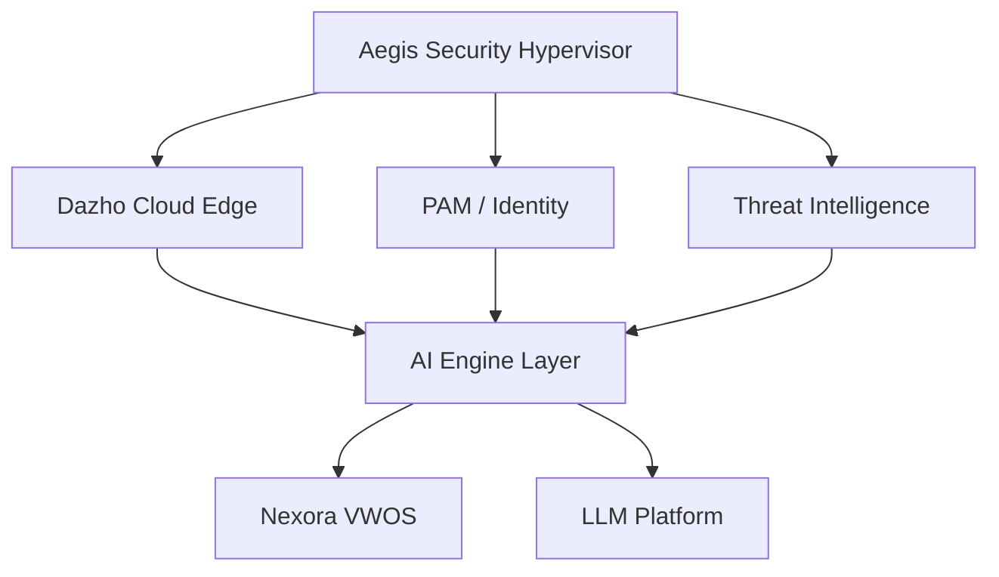
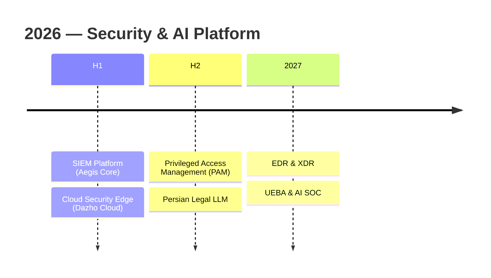

# Mohammad Hossein Rezaei

### AI & Security Systems Engineer

 

---

# Mission

I design systems at the intersection of **cybersecurity**, **distributed systems**, and **artificial intelligence**—building long-lived infrastructure rather than short-lived applications.

I'm working toward an ecosystem of security and AI products that enables organizations to operate entirely on self-hosted infrastructure.

---

# Engineering Principles

`Security by Design` · `Self-Hosted First` · `Performance Matters` · `Infrastructure over Applications` · `Composability`

---

---

# Current Focus

- Building the **Aegis Security Hypervisor** — 14 Rust microservices
- Developing a **Persian legal foundation model** — tokenizer, pretraining, alignment, GGUF
- Architecting **Nexora** — a Virtual World Operating System (Rust + Go)

---

# Core Expertise

### Systems Programming

`Rust` `Go` `C++` `Python` `C#` `TypeScript`

### Security Engineering

`SIEM` `SOAR` `PAM` `WAF` `DDoS` `IDS/IPS` `Zero Trust` `ADL`

### AI Engineering

`PyTorch` `TensorFlow` `LLM` `RAG` `GNN` `Anomaly Detection`

### Cloud Infrastructure

`Docker` `Kubernetes` `Kafka` `PostgreSQL` `Redis` `NATS` `Nginx`

---

# Featured Projects

## 🛡️ Aegis — Dazho Security Platform

Enterprise Security Hypervisor — 14 Rust microservices evolving from SIEM into a unified security OS.

`Rule Engine` `Alert Service` `Incident Management` `SOAR` `Threat Intel` `Search` `Ingest` `Asset`

**Rust · React · PostgreSQL · Redis · NATS**

---

## 🌐 Dazho Cloud

AI-powered secure edge platform combining WAF, CDN, load balancing, DDoS protection, and API security.

**Python · FastAPI · ML Ensembles · Docker · K8s**

---

## 🔐 PAM — Privileged Access Management

Zero-trust PAM with credential vault, session proxy (SSH/RDP/DB), JIT access, and compliance tooling.

**FastAPI · Next.js 15 · React 19 · PostgreSQL**

---

## 🧠 Legal-LLM

Building a Persian legal foundation model — BPE tokenizer, GPT-style pretraining, SFT, DPO alignment, GGUF deployment.

**PyTorch · Transformers · LoRA · llama.cpp**

---

## 🖥️ Nexora — Virtual World OS

A Virtual World Operating System for millions of concurrent users. Rust core with Go services and React web panel.

**Rust · Go · TypeScript · gRPC · QUIC · ClickHouse · K8s**

---

# Roadmap

---

# Other Projects

[`AnomalyTrafficDetector`](https://github.com/mhrezaeii/AnomalyTrafficDetector) · [`DeepPacket_Red`](https://github.com/mhrezaeii/DeepPacket_Red) · [`SecureCodeAudit`](https://github.com/mhrezaeii/SecureCodeAudit) · [`AutoExploit_Piper`](https://github.com/mhrezaeii/AutoExploit_Piper) · [`OfflineGuardian`](https://github.com/mhrezaeii/OfflineGuardian) · `MY_J.A.R.V.I.S.` · `360 ERP/EMS` · `Zero Day` · `Software Intelligence Platform` · `Nobatvakil AI`

---

# GitHub Analytics

 

 

 

<picture>
  <source media="(prefers-color-scheme: dark)" srcset="https://raw.githubusercontent.com/mhrezaeii/mhrezaeii/output/github-contribution-grid-snake-dark.svg">
  <source media="(prefers-color-scheme: light)" srcset="https://raw.githubusercontent.com/mhrezaeii/mhrezaeii/output/github-contribution-grid-snake.svg">
  
</picture>

---

# Connect

---

### Design infrastructure. Build platforms. Solve real problems.

⭐ Thanks for visiting my profile.

